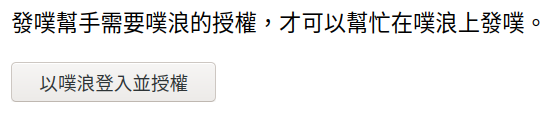
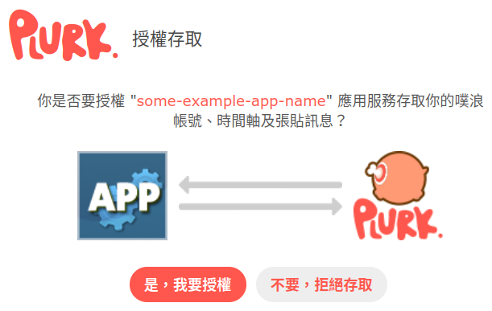
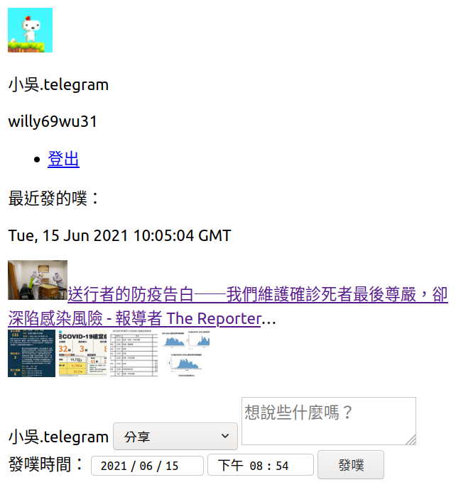

# 發噗幫手

## 這啥

利用噗浪 API 製作的發噗工具。

以 PHP + Laravel 製作，目前功能如下：

* 發噗
* 預約發噗
* 觀看最新一則自己的噗

## 螢幕擷圖







## 系統需求

- Linux（其他系統沒試過）
- Composer（PHP 套件管理器）
- Docker
- Docker Compose

## 安裝

請先從範本建立環境設定檔：

```shell
cp .env.example .env
```

應用程式的 key、secret 等資料需在 <https://www.plurk.com/PlurkApp/> 申請，並填到 `.env` 檔案的開頭兩行內。

環境設定檔搞定之後，再執行：

```shell
composer install
sail artisan key:generate
sail up -d
sail artisan migrate
```

等 Docker 容器啟動後再瀏覽 <http://localhost/>。

若要正常執行預約發噗，請執行 `sail artisan schedule:work` 。

## 已知問題

Q：不能用 `crontab` 來定時執行預約發噗功能嗎？  
A：用 `crontab` 來定時執行會出現 `the input device is not a TTY` ，目前找不到簡易的解決辦法。
